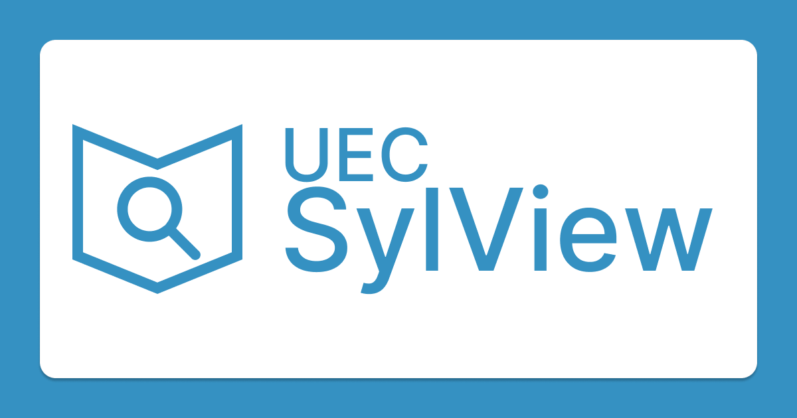

# UEC SylView

<div align="center">
  
</div>

UEC SylViewは、電気通信大学の講義情報や進級審査情報を提供するWebサイト(非公式)です。

[UEC Atlas プロジェクト](https://uec-atlas.org/)が提供するオープンデータをもとに生成されています。

> [!WARNING]
> このプロジェクトは学生主体で運営されており、大学の公式なプロジェクトではありません。 情報の正確性や完全性は保証されないため、最新の情報や正式な情報が必要な場合は、大学の公式な情報源を参照してください。

## 開発環境

### Setup

Make sure to install dependencies:

```bash
pnpm install
```

### Development Server

Start the development server on `http://localhost:3000`:

```bash
pnpm dev
```

### Production

Build the application for production:

```bash
pnpm build
```

Locally preview production build:

```bash
pnpm preview
```

Check out the [deployment documentation](https://nuxt.com/docs/getting-started/deployment) for more information.
